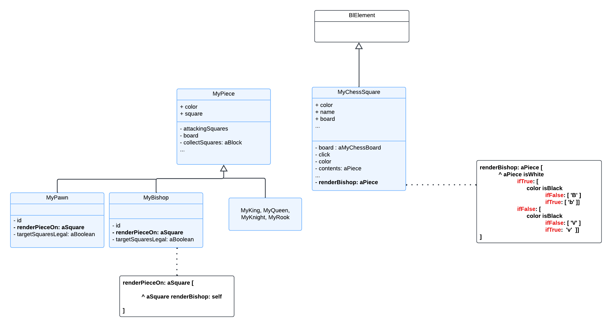
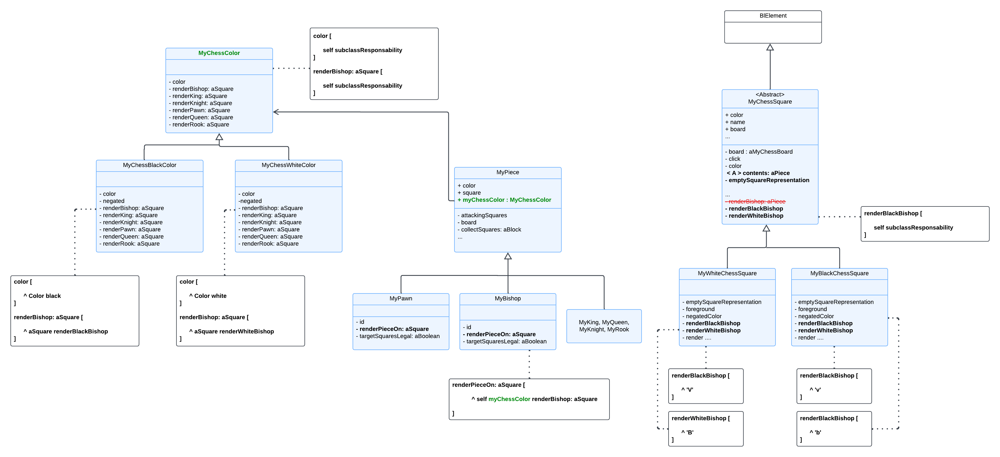

## Getting started

### Getting the code

This code has been tested in Pharo 12. You can get it by installing the following baseline code:

```smalltalk
Metacello new
	repository: 'github://UnivLille-Meta/Chess:main';
	baseline: 'MygChess';
	onConflictUseLoaded;
	load.
```

### Using it

You can open the chess game using the following expression:

```smalltalk
board := MyChessGame freshGame.
board size: 800@600.
space := BlSpace new.
space root addChild: board.
space pulse.
space resizable: true.
space show.
```

## KATAS 

### Pawlowski Florine 
#### refactor piece rendering 

Pour l'élaboration de mon kata je vous conseille de lire mes rubriques KATA sur ce repo : 

https://github.com/PawlowskiFlo/Miage23/blob/2024/Groups/G04/report_week03.md

(week 03 / week 05 / week 06 / week 08) 

#### solution apportée 

Durant mes dernieres séances sur ce kata j'ai modifié mes derniers changements, j'ai fait un peu de refactoring en retirant quelques méthodes inutiles (par exemple renderBishop: et tous les autres render dans la classe MyChessSquare puisque on peut mettre en place le double dispacth directement grâce à myChessColor (qui est une stratégie) dans les méthodes renderPieceOn de chaque type de pièce.) 

En finalité nous n'avons plus aucun block conditionnel dans les méthodes render. Ceci étant possible grâce à la stratégie mise en place ( MyChessColor -> MyChessWhiteColor / MyChessBlackColor qui est une stratégie sur la couleur de la pièce) et grâce à l'héritage mis en place sur MyChessSquare qui est la super classe de MyWhiteChessSquare et MyBlackChessSquare. 
La pièce, à sa création, connaît myChessColor (stratégie noire ou blanche finalement) et grâce à cette stratégie et en lui passant un square de type blanc ou noir en paramètre, la méthode renderPieceOn fera appel à la bonne méthode de rendering en appliquant le double dispatch sur myChessColor et aSquare. 

J'ai produit ce refactoring en créant des tests dès le départ que j'ai dû légérement modifer (surtout la partie set up de mes variables par exemple on construit un test en créant un MyBlackChessSquare et pas seulement un MyChessSquare classique ) 

Voici l'UML du projet de départ centré sur les classes dont on s'occupe particulièrement pour le refactoring des méthodes de render:



Voici l'UML de ma solution apportée pour ce KATA : 



Je n'ai volontairement pas tout représenté, il manque certaines méthodes et bien sûr les classes environnantes du projet Chess. Pour les exemples, j'ai à chaque fois pris renderBishop mais la logique est la même pour toutes les autres méthodes de rendering. 

#### introspection 

Pour ce kata j'ai choisi de d'abord faire les tests, puis de réfléchir à une première solution (square blanc et square noir) 
cette première partie était bien pensée puisque j'ai fait les tests d'abord et l'implémentation ensuite. 
Toutefois comme ce n'était pas suffisant j'ai ajouté la stratégie sur la couleur mais je n'avais pas encore modifié mes tests et j'ai tout changé en même temps en un seul gros "block" ce qui n'est pas une très bonne pratique car j'aurais pu casser tout mon code (heureusement ce n'était pas le cas ici car le projet n'est pas très gros). J'ai quand même procédé par étapes c'est à dire par exemple m'occuper seulement de MyChessWhiteColor puis ensuite MyChessBlackColor, puis modifier ou valider les tests etc.
A l'avenir j'essaierais de modifier mon code par plus petits blocks en vérifiant que les tests ne sont pas cassés ou en créant des méthodes intermédiaires par exemple qui permettent de maintenir un code fonctionnel pendant les changements. 

#### Pour aller plus loin 
J'ai laissé la variable color dans MyPiece car je sais que le Kata d'evann l'utilise pour éviter de lui ajouter du travail en plus alors qu'il avait fini, mais celle ci en soit n'est plus utile car elle redirige vers la couleur de myChessColor. Pour aller plus loin il faudrait retirer cette variable et veiller à changer toutes les méthodes utilisant color en remplaçant par "myChessColor color" 
